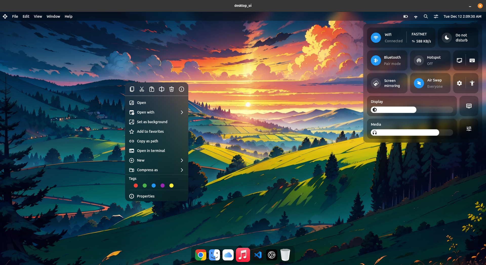

# Linux Desktop UI Design Concept
This project is a design concept of the Linux using Flutter, a popular cross-platform framework for building desktop applications. The goal of this project is to create a visually appealing and user-friendly interface for desktop design.

### Project Structure
 #### The project structure is organized in the following way:

* lib: contains the main Dart code for the application
* common: contains generic components for the application
* widgets: contains different widgets used throughout the application
* assets: contains any necessary assets used in the application 

### Installation
#### Clone the repository using the following command:
```bash    
git clone https://github.com/iamkartiknayak/Flutter_Linux_Desktop_UI_Conecpt.git
```
#### Rename the project directory before running flutter commands
```bash
mv Flutter_Linux_Desktop_UI_Conecpt desktop_ui
```
#### Navigate to the project directory:
```bash 
cd desktop_ui
```
#### Install the dependencies:
```bash 
flutter pub get
```
#### Run the application:
```bash 
flutter run
```
### Screenshots

&nbsp;&nbsp;&nbsp;

<video src="./screenshots/sample.mp4" alt="Example Image" width="250">&nbsp;&nbsp;&nbsp;

### Conclusion
This Desktop UI design is a demonstration of how Flutter can be used to create beautiful and functional user interfaces. The code is open source and can be used as a starting point for your own Flutter projects.

PS: Release build executable has some bugs, works fine in debug.
